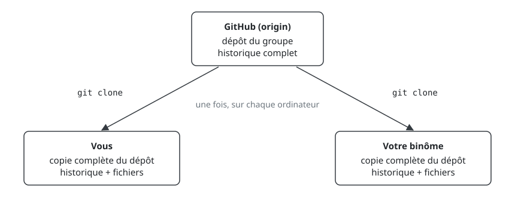
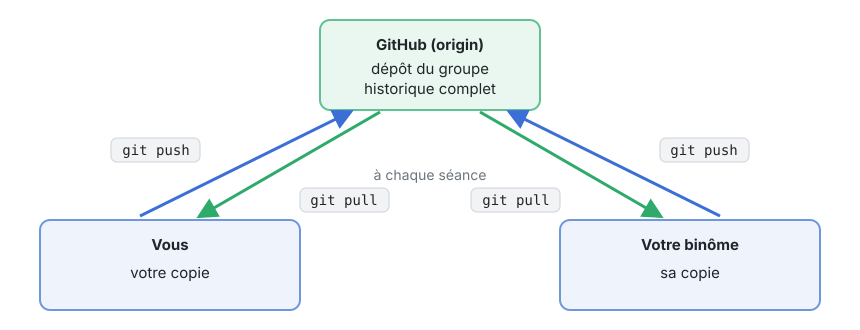
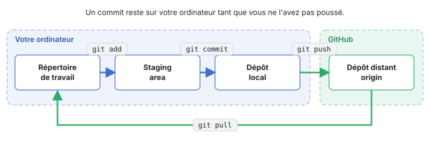
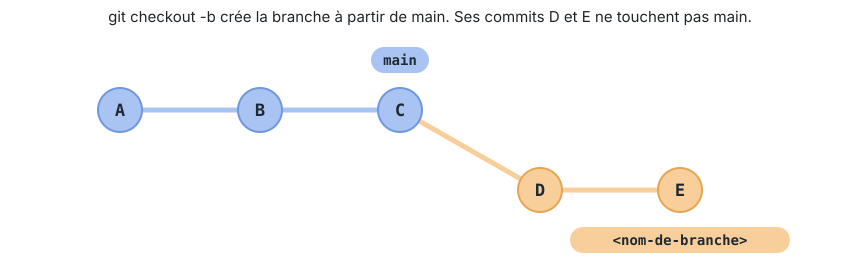
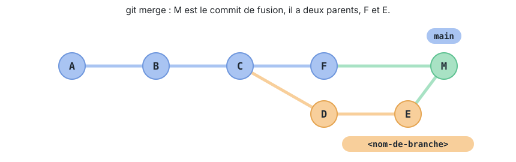
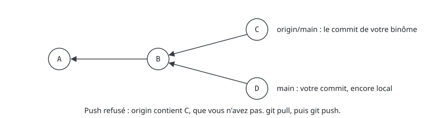
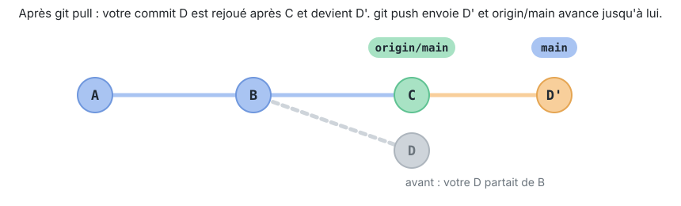
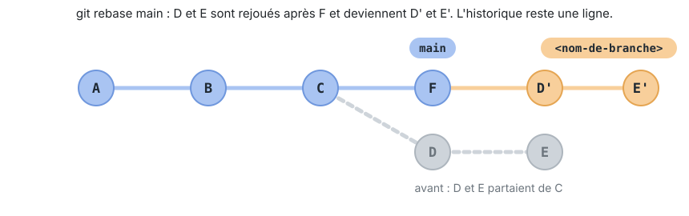
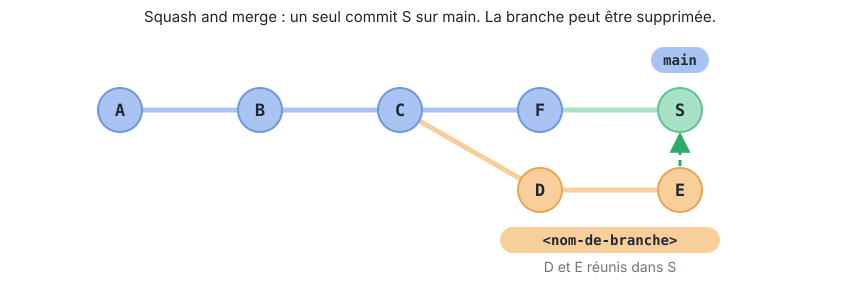

## Git

> Git est un système de contrôle de version distribué, libre et gratuit,
> conçu pour gérer des projets de toute taille avec rapidité et efficacité.
> (<https://git-scm.com/>)

### Dépôts et clones

Un **dépôt** Git contient votre projet et tout son historique. Git est
**distribué** : chaque **clone** est une copie complète du dépôt,
historique compris. Vous pouvez travailler et commiter sans connexion, puis
synchroniser plus tard. Par convention, la copie sur GitHub s'appelle le
**remote** (`origin`) et la copie sur votre machine est votre dépôt local.
Dans un binôme, il y a donc trois copies du dépôt. La première fois, chacun
crée la sienne avec `git clone` :

{width="90%" fig-alt="GitHub en haut, deux ordinateurs qui clonent le dépôt"}

Ensuite, chaque copie ne voit le travail des autres qu'au moment où on le
lui envoie : `git push` envoie vos commits à GitHub, `git pull` récupère
ceux de votre binôme.

{width="90%" fig-alt="GitHub en haut, deux ordinateurs qui poussent et tirent"}

### Commits, hash et tags

Git enregistre les changements sous forme de **commits** : des photos du
projet à un moment donné. Chaque commit a un **hash** unique, calculé à
partir de son contenu : on ne peut pas modifier un commit sans changer son
hash, ce qui rend l'historique fiable. Un **tag** est un nom lisible
donné à un commit, typiquement une version (`v1.0.0`).

### Les quatre zones

Entre votre éditeur et GitHub, un changement passe par quatre endroits :

1. Le **répertoire de travail** : les fichiers que vous éditez.
2. La **staging area** : les changements que vous avez marqués pour le
   prochain commit (`git add`). Git l'appelle aussi *index* dans ses
   messages.
3. Le **dépôt local** : les commits enregistrés (`git commit`), sur votre
   ordinateur.
4. Le **dépôt distant** sur GitHub, qui ne reçoit vos commits qu'avec
   `git push` et dont vous récupérez ceux de votre binôme avec `git pull`.

{width="100%" fig-alt="Répertoire de travail, staging area, dépôt local, dépôt distant, reliés par git add, git commit, git push et git pull"}

**Un commit est local.** Tant que vous n'avez pas poussé, votre binôme ne
voit rien et GitHub ne contient rien de votre travail : à l'échéance, seul
ce qui a été poussé compte. `git status` montre où se trouve chaque
changement, `git diff` montre ce qui a changé mais n'est pas encore dans
la staging area.

### Branches

Une **branche** est un pointeur mobile vers un commit ; la branche par
défaut s'appelle `main`. Créer une branche est instantané (ce n'est qu'un
pointeur). C'est pourquoi on développe une fonctionnalité ainsi : partir
de `main`, commiter sur la branche, fusionner quand c'est prêt.
`HEAD` est le pointeur vers l'endroit où vous vous trouvez.

{width="100%" fig-alt="Une branche qui part du dernier commit de main avec deux commits à elle"}

### Fusion

Ramener le travail d'une branche dans `main` se fait par un **merge** : Git
combine les deux branches dans un *commit de fusion*. Ce commit a deux
parents : le dernier commit de `main` et le dernier commit de la branche.
Avec **Squash and merge** sur GitHub, il n'y a pas de commit de fusion :
`main` reçoit un seul nouveau commit, avec un seul parent, comme si vous
l'aviez fait directement sur `main`.

{width="100%" fig-alt="Un commit de fusion M avec deux parents, le dernier commit de main et celui de la branche"}

### Conflits

Quand deux personnes modifient **les mêmes lignes** du même fichier, Git ne
peut pas décider pour vous : la fusion s'arrête sur un **conflit** et
marque le fichier :

```text
<<<<<<< HEAD
Une ligne ajoutée par vous.
=======
Une ligne ajoutée par quelqu'un d'autre.
>>>>>>> autre-branche
```

Vous résolvez en éditant le fichier (garder ce qui doit rester, supprimer
les marqueurs), puis `git add` sur le fichier, et enfin `git commit` pour
terminer la fusion. Attention pendant un `git pull` avec `pull.rebase`
(voir [le push refusé](#tout-le-monde-sur-main-et-le-push-refusé)) : les
rôles sont inversés. `HEAD` est le travail de votre binôme, déjà poussé ;
le bloc du dessous est votre commit, en train d'être rejoué. On termine
alors par `git rebase --continue`. Pour tout annuler et revenir à l'état
d'avant : `git rebase --abort`.

### Ignorer des fichiers

Un fichier `.gitignore` à la racine du dépôt liste ce que Git ne doit pas
suivre : résultats de compilation, configuration de l'IDE. Pour un projet
CLion et CMake :

```gitignore
# Dossiers de build de CLion et de CMake
cmake-build-*/
build/

# Configuration locale de l'IDE
.idea/
```

Bonne pratique : ne commiter **que les sources** (`*.cpp`, `*.h`,
`CMakeLists.txt`, `README.md`), jamais les exécutables ni les dossiers de
build.

::: {.callout-tip collapse="true" title="Aide-mémoire Git"}
```sh
git clone <url>            # cloner un dépôt
git status                 # ce qui a changé, et où
git diff [<fichier>]       # changements pas encore dans la staging area
git add <fichier>          # ajouter à la staging area
git commit -m "Message"    # commiter la staging area
git checkout -b <branche>  # créer une branche et s'y placer
git checkout <branche>     # changer de branche
git merge <branche>        # fusionner une branche dans la courante
git rebase main            # rejouer la branche courante après main
git rebase --continue      # reprendre après un conflit résolu
git rebase --abort         # annuler le rebase en cours
git push                   # envoyer vos commits au remote
git pull                   # récupérer et intégrer les commits du remote
git log                    # historique (q pour quitter)
```
:::

## GitHub et Roster

GitHub héberge les dépôts Git et ajoute la collaboration : issues, pull
requests, revue de code.

Pour les laboratoires, [Roster]() crée pour chaque
groupe un dépôt GitHub privé dans l'organisation du cours. Le déroulement :

1. Pour chaque laboratoire, vous acceptez l'*assignment* : Roster crée le
   dépôt (ou vous y ajoute si votre binôme l'a déjà accepté).
2. Vous clonez le dépôt, travaillez, commitez et poussez. **Ce qui est sur
   GitHub à l'échéance est ce qui est corrigé.**

### Authentification SSH

SSH permet de pousser et tirer sans taper de mot de passe, c'est
l'authentification à utiliser tout le semestre. La mise en place est
décrite dans le guide d'installation, section
[Authentification SSH](installation.qmd#authentification-ssh).

**Vérification** : `ssh -T git@github.com` vous salue par votre nom
d'utilisateur.

## Travailler à deux

Vous et votre binôme pouvez tous les deux écrire dans le dépôt du
laboratoire. Deux façons de travailler ; **nous recommandons la
première**.

### Une branche par personne ou par fonctionnalité

Chacun travaille sur sa branche, puis ouvre une **pull request** (PR) :
une demande d'intégrer la branche dans `main`. Le binôme relit le code
avant de fusionner. Avantages : le code est relu avant d'entrer dans
`main`, et l'historique reste lisible, avec un commit par fonctionnalité.
Le déroulement complet :

1. Créer la branche et s'y placer. Le nom doit décrire ce que la branche
   apporte (fonctionnalité principale), par exemple `resolution-ex-1` :

   ```sh
   git checkout -b <nom-de-branche>
   ```

2. Travailler, puis commiter comme d'habitude :

   ```sh
   git add main.cpp
   git commit -m "<ce que le commit apporte>"
   ```

3. Pousser la branche en la liant au remote (`-u`, la première fois
   seulement) :

   ```sh
   git push -u origin <nom-de-branche>
   ```

4. Sur GitHub, un bandeau **Compare & pull request** apparaît sur la page
   du dépôt. Cliquez, donnez un titre et une description en trois lignes,
   par exemple :

   ```text
   Quoi : saisie du nom et affichage du message de bienvenue
   Pourquoi : première étape du programme de présentation
   À vérifier : le nom avec espaces est bien lu en entier
   ```

5. Dans **Reviewers**, choisissez votre binôme, puis **Create pull
   request**.

6. Le binôme ouvre l'onglet **Files changed**, lit le code, commente si
   besoin, puis **Review changes > Approve > Submit review**.

7. Fusion : le bouton vert propose trois méthodes dans son menu. **Create
   a merge commit** garde tous les commits de la branche, **Rebase and
   merge** les rejoue un à un sur `main`, **Squash and merge** les réunit
   en un seul commit. Le cours
   utilise **Squash and merge** : un commit par fonctionnalité dans
   `main`, historique facile à lire. Choisissez-le, gardez ou corrigez le
   message proposé, confirmez. Ne cherchez pas de commit de fusion dans
   l'historique : avec le squash, il n'y en a pas, `main` reçoit un seul
   nouveau commit.

8. Cliquez **Delete branch** : vous n'avez plus besoin de la branche.

9. De retour dans le terminal, mettez `main` à jour :

   ```sh
   git checkout main
   git pull
   ```

Dans CLion : **Git > New Branch** crée la branche et s'y place ; **Git >
Push** propose de créer la branche distante et affiche ensuite un lien
**Create Pull Request** ; le reste se passe sur GitHub. Les commandes
équivalentes sont dans [Pour aller plus loin](#rebase-squash).

### Tout le monde sur `main`, et le push refusé

Certains binômes commitent directement sur `main`. Tôt ou tard, vous verrez
ceci :

```text
> git push
 ! [rejected]        main -> main (fetch first)
error: failed to push some refs to 'https://github.com/...'
hint: Updates were rejected because the remote contains work that you do
hint: not have locally.
```

Rien n'est cassé : votre binôme a poussé sur `main` avant vous, et votre
copie de `main` n'est plus à jour.

{width="100%" fig-alt="Deux commits issus du même parent : celui du binôme sur origin/main, le vôtre sur main"}

Pour vous en sortir, grâce au réglage `pull.rebase` du
[guide d'installation](installation.qmd#configuration-de-git), qui place
vos commits après les leurs :

```sh
git pull
git push
```

{width="100%" fig-alt="Après le pull, votre commit est rejoué après celui du binôme, sur une seule ligne, prêt à être poussé"}

Si vos changements et les leurs touchent les mêmes lignes, le pull s'arrête
sur un conflit : résolvez les fichiers marqués (voir
[Conflits](#conflits)), puis

```sh
git add <fichier-résolu>
git rebase --continue
git push
```

::: {.callout-important}
Entraînez-vous **avant** la première échéance de laboratoire : le push
refusé arrive toujours au pire moment sinon.
:::

## Git dans CLion

Tout ce qui précède est disponible dans CLion sans quitter l'IDE :

- **Cloner un dépôt de laboratoire**, dans l'ordre :
  1. acceptez l'*assignment* sur Roster, qui vous mène au dépôt GitHub ;
  2. sur GitHub, bouton **Code**, onglet **SSH**, copiez l'URL ;
  3. dans CLion, **File > New > Project from Version Control**, collez
     l'URL, choisissez le dossier, **Clone** ;
  4. répondez **Trust Project** ; CLion charge le `CMakeLists.txt` (bandeau
     *Reload CMake project* si besoin) ;
  5. choisissez la cible dans la liste de lancement et cliquez **Run**.

  L'équivalent en ligne de commande : `git clone git@github.com:<org>/<depot>.git`.
- **Commiter** : **Git > Commit** (ou l'onglet *Commit* à gauche) montre les
  fichiers modifiés, la différence ligne par ligne et le message.
- **Pousser et tirer** : **Git > Push** et **Git > Pull**, aussi dans la
  barre d'outils en haut à droite.
- **Historique** : **Git > Show Git Log**.
- **Conflits** : après un **Pull**, CLion liste les fichiers en conflit
  dans une fenêtre *Conflicts*. **Accept Yours** ou **Accept Theirs** y
  prennent un côté en bloc ; **Merge** ouvre un outil à trois colonnes
  (votre version, le résultat, leur version) où les flèches insèrent un
  changement à la fois dans la colonne centrale, puis **Apply** enregistre
  et **Abort** annule.

Le terminal intégré (**View > Tool Windows > Terminal**) reste disponible
pour les commandes de l'aide-mémoire.

## Pour aller plus loin

::: {.callout-note collapse="true" title="Bonnes habitudes"}
- `git pull` en début de séance, avant de toucher au code.
- `git status` avant chaque commit, pour voir ce qui va partir.
- Des commits petits et fréquents, avec un message qui dit ce qu'ils
  apportent.
- `git push` en fin de séance : un commit non poussé n'existe que sur votre
  ordinateur.
- Jamais de dossier de build ni de configuration d'IDE dans le dépôt : le
  `.gitignore` s'en charge, ne le contournez pas.
:::

::: {#rebase-squash .callout-note collapse="true" title="Merge, rebase et squash en ligne de commande"}
Sur GitHub, les trois méthodes sont des boutons. En ligne de commande,
tout dépend de la branche sur laquelle on se trouve : la commande agit
sur la branche courante.

**Merge** : depuis `main`, on ramène la branche ; Git crée un commit de
fusion.

```sh
git checkout main
git merge <nom-de-branche>
```

**Rebase** : depuis sa branche, on rejoue ses commits par-dessus `main`.
Le rebase ne déplace pas `main` : il faut encore, depuis `main`, ramener
la branche ; comme elle commence maintenant juste après `main`, `main`
avance simplement jusqu'à elle, sans commit de fusion.

```sh
git checkout <nom-de-branche>
git rebase main
git checkout main
git merge <nom-de-branche>
```

{width="100%" fig-alt="Les commits de la branche rejoués après le dernier commit de main, l'historique est une ligne"}

**Squash** : depuis `main`, on ramène tous les commits de la branche en un
seul, qu'il reste à commiter.

```sh
git checkout main
git merge --squash <nom-de-branche>
git commit -m "<ce que la branche apporte>"
```

{width="100%" fig-alt="Un seul commit S sur main qui réunit les commits de la branche"}
:::

::: {.callout-note collapse="true" title="Messages de commit"}
Il n'existe pas de règle universelle ; l'important est de toujours faire
pareil. Une bonne habitude : un verbe à l'infinitif et une courte description
(« Ajouter la lecture du fichier », « Corriger le calcul de la moyenne »).
:::

::: {.callout-note collapse="true" title="Apprendre Git visuellement"}
- [Learn Git Branching](https://learngitbranching.js.org/) : exercices
  interactifs, excellents pour branches, merges et rebases.
- [Pro Git](https://git-scm.com/book/fr) : le livre de référence, gratuit,
  en français.
- [Tutoriels Git d'Atlassian](https://www.atlassian.com/fr/git/tutorials) :
  chaque commande illustrée d'un schéma.
:::

## Sources

- O. Tischhauser, avec l'aide de [Claude](https://claude.com) (Anthropic).
- [cours DAI](https://github.com/heig-vd-dai-course/heig-vd-dai-course)
  de L. Delafontaine et H. Louis (HEIG-VD), licence
  [CC BY-SA 4.0](https://creativecommons.org/licenses/by-sa/4.0/).
